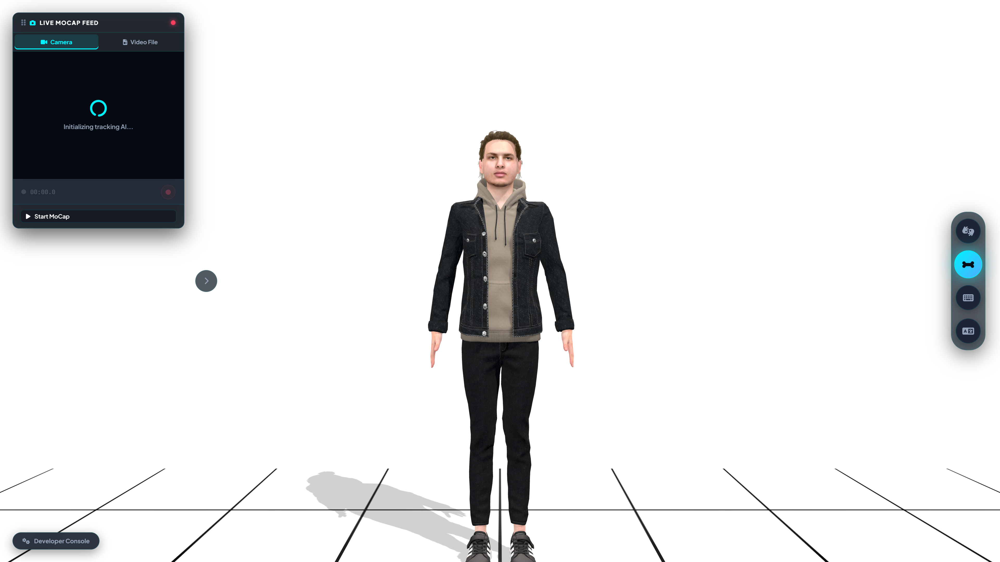
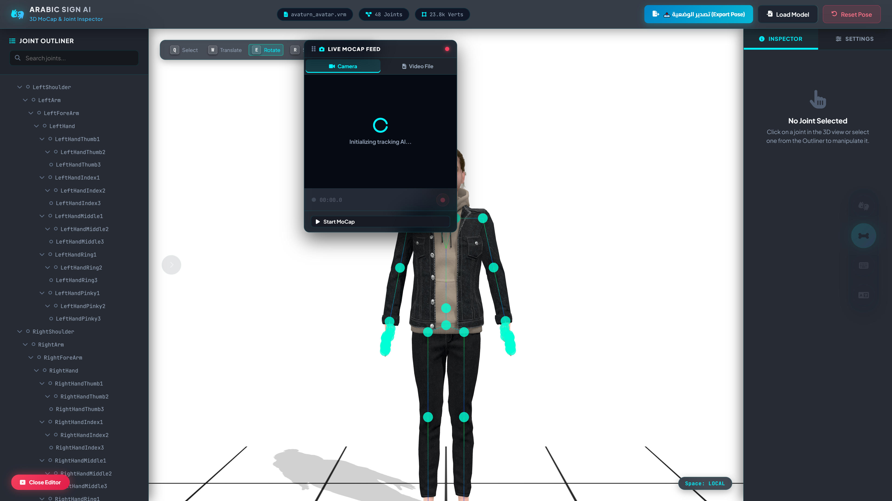
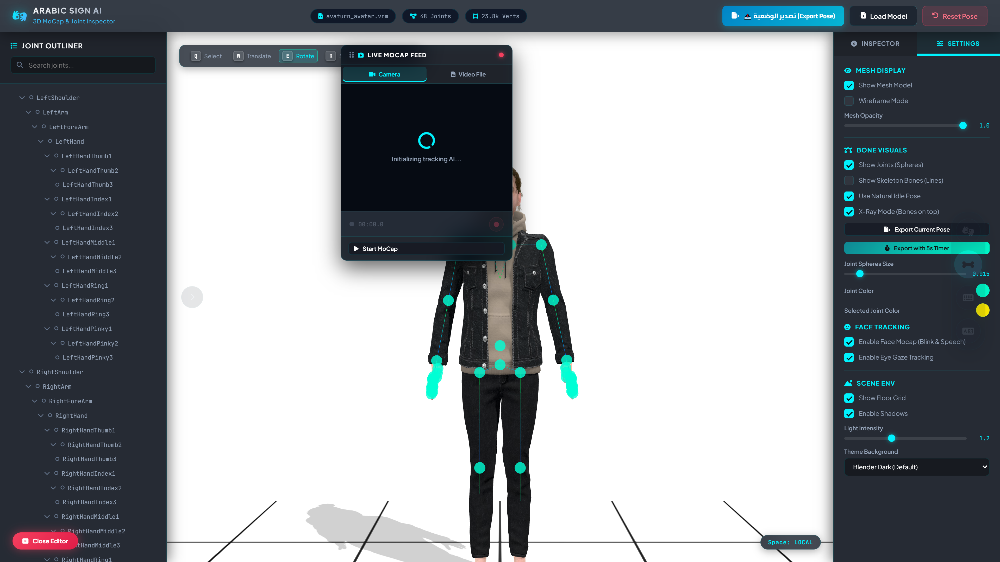
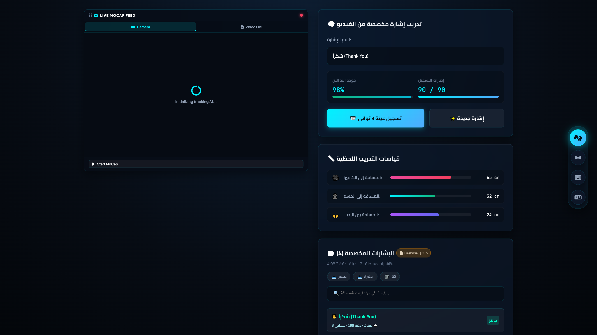
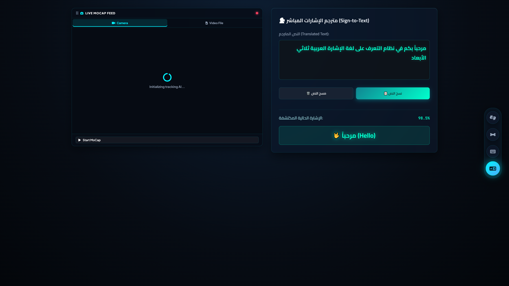
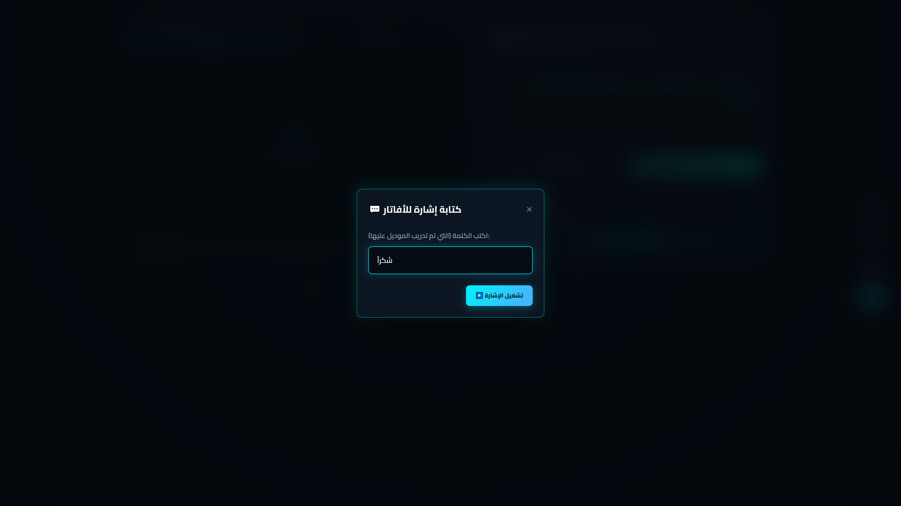

<div align="center">

# 🤟 Arabic Sign Language Recognition & 3D MoCap AI System

<br/>



<br/><br/>

[](https://arabic-sign-mocap-3d.vercel.app)
[](https://github.com/marwanzidan086-coder/arabic-sign-language-mocap-3d/stargazers)
[](LICENSE)
[](https://threejs.org/)
[](https://developers.google.com/mediapipe)
[](https://firebase.google.com/)
[](#)
[](CONTRIBUTING.md)

<br/>

**A Next-Generation AI Motion Capture & Arabic Sign Language Recognition Platform connecting Computer Vision, 3D Kinematics, and Cloud Synchronization.**

<br/>

[🚀 Live Demo](#-live-demo) • [✨ Key Features](#-key-features) • [📸 Visual Showcase](#-visual-showcase) • [🛠️ Architecture](#-system-architecture) • [🎓 Gesture Trainer](#-custom-gesture-trainer--recognition-engine) • [⚡ Quick Start](#-quick-start--local-setup) • [📁 Project Structure](#-project-structure) • [🤝 Contributing](#-contributing)

---

</div>

<br/>

## 🌐 Live Demo

Experience the full AI system directly in your modern desktop or mobile browser with zero installation:

<div align="center">

👉 **[https://arabic-sign-mocap-3d.vercel.app](https://arabic-sign-mocap-3d.vercel.app)** 👈

</div>

> [!TIP]
> **100% In-Browser Hardware Acceleration (60 FPS):**  
> All computer vision, pose estimation, and 3D kinematics run entirely on the client side using `WebGL 2.0`, `Web Workers`, and `SIMD-accelerated MediaPipe Tasks`. Camera frames never leave your local device, guaranteeing zero latency and 100% user privacy.

---

## ✨ Key Features

<table>
  <tr>
    <td width="50%">
      <h3>🤖 1. Real-Time 3D MoCap & VRM Avatar</h3>
      <ul>
        <li><b>VRM 3D Avatar Support:</b> Real-time skeletal retargeting onto standard humanoid <code>.vrm</code> / <code>.glb</code> models.</li>
        <li><b>Holistic Body & Face Tracking:</b> Tracks head orientation, eye gaze, facial expressions (BlendShapes), and full body posture.</li>
        <li><b>Dual-Hand Dexterity:</b> 21 3D joint landmarks per hand with wrist rotation normalization.</li>
        <li><b>Natural Idle Breathing:</b> Procedural breathing and idle dynamics when motion is paused.</li>
      </ul>
    </td>
    <td width="50%">
      <h3>🎓 2. Custom Gesture Trainer & Studio</h3>
      <ul>
        <li><b>3-Second Motion Stream Capture:</b> High-speed keyframe sequence sampling (30–60 FPS) with automated noise elimination.</li>
        <li><b>Geometric Vector Classification:</b> Dynamic finger distance matrices & Cosine similarity matching algorithms.</li>
        <li><b>3D Keyframe Playback Modal:</b> Frame-by-frame timeline scrubber to inspect recorded joint trajectories before saving.</li>
        <li><b>Firebase Cloud Sync:</b> Instant global synchronization of newly trained signs to Google Cloud Firestore.</li>
      </ul>
    </td>
  </tr>
  <tr>
    <td width="50%">
      <h3>💬 3. Continuous Sign-to-Text Translator</h3>
      <ul>
        <li><b>Instant Translation HUD:</b> Continuous real-time detection converting dynamic sign gestures into readable Arabic text.</li>
        <li><b>One-Euro Filter Smoothing:</b> Adaptive cutoff frequency filtering eliminating webcam jitter while preserving sharp motion response.</li>
        <li><b>Text-to-Sign Playback:</b> Interactive modal allowing users to type trained words and watch the 3D avatar perform the sign.</li>
        <li><b>Clipboard & Buffer Tools:</b> One-click copy, clear, and live confidence score metrics.</li>
      </ul>
    </td>
    <td width="50%">
      <h3>🛠️ 4. Developer Console & Joint Inspector</h3>
      <ul>
        <li><b>Interactive Bone Hierarchy Tree:</b> Full outliner tree of all 48 humanoid joints with live search filtering.</li>
        <li><b>Transform Gizmos & Sliders:</b> Precise manual control over Euler rotations, translation offsets, and bone scaling.</li>
        <li><b>Custom Pose & VMD Exporter:</b> Export captured poses as formatted JSON datasets or MikuMikuDance (VMD) motion files.</li>
        <li><b>Studio Viewport Settings:</b> Control mesh wireframe, joint sphere radiuses, X-Ray mode, and lighting environments.</li>
      </ul>
    </td>
  </tr>
</table>

---

## 📸 Visual Showcase

<div align="center">

### 1. Modern 3D Studio & Clean Minimalist Mode
*Radiant milk-white studio room featuring architectural Boiseries wall mouldings and high-contrast perspective floor grid.*


### 2. Developer Console & Skeletal Joint Outliner
*Full joint hierarchy inspection with real-time Euler rotation sliders, space toggles, and hotkey Transform Gizmos.*


### 3. Viewport & Skeleton Display Settings
*Customizable joint spheres, X-Ray bone overlays, mesh wireframe mode, and ambient studio light controls.*


### 4. Custom Gesture Trainer & Metric HUD
*Interactive sign recording dashboard showing live hand tracking quality, proximity distances, and Firebase Cloud database sync.*


### 5. Real-Time Arabic Sign-to-Text Translator
*Continuous sign language recognition HUD displaying live prediction confidence and accumulated translated text.*


### 6. Interactive Text-to-Sign Avatar Playback
*Input any trained Arabic word or phrase to trigger smooth 3D avatar animation playback.*


</div>

---

## 🛠️ System Architecture

```mermaid
flowchart TD
    subgraph Input ["📷 Video & Stream Ingestion"]
        Cam[Live Webcam / Video File Stream]
    end

    subgraph VisionAI ["🧠 Computer Vision & Tracking Pipeline"]
        MP[Google MediaPipe Tasks Vision]
        Filter[One-Euro Jitter Filter]
        Cam --> MP
        MP -->|Raw 3D Landmarks| Filter
    end

    subgraph Kinematics ["⚡ Kinematics & AI Classification Engine"]
        Retarget[Humanoid Kinematic Retargeter]
        Classifier[Dynamic Sign Matching & KNN Engine]
        Filter -->|Smoothed Pose & Hands| Retarget
        Filter -->|Geometric Feature Vectors| Classifier
    end

    subgraph Rendering ["🎮 WebGL 3D Viewport"]
        ThreeJS[Three.js Engine r160]
        VRMAvatar[VRM Humanoid Avatar + BlendShapes]
        Studio[Milk-White Studio + Boiseries Moulding]
        Retarget -->|Joint Rotations (Quaternions)| VRMAvatar
        VRMAvatar --> ThreeJS
        Studio --> ThreeJS
    end

    subgraph Persistence ["☁️ Hybrid Storage & Cloud Synchronization"]
        LocalDB[(IndexedDB Cache - idb-keyval)]
        CloudDB[(Google Cloud Firestore)]
        Classifier <--> LocalDB
        LocalDB <-->|Real-time Sync| CloudDB
    end

    subgraph Presentation ["🖥️ User Interface & Output HUD"]
        Display[Glassmorphic UI Overlay]
        TranslatorHUD[Live Sign-to-Text Output HUD]
        ThreeJS --> Display
        Classifier -->|Predicted Arabic Text & Score| TranslatorHUD
    end
```

---

## 🎓 Custom Gesture Trainer & Recognition Engine

The system features an autonomous, browser-based gesture training engine that enables anyone to train, test, and deploy new Arabic signs in seconds:

1. **3-Second Stream Capture**: Samples sequential keyframes of finger joints and wrist coordinates at 30–60 FPS.
2. **Wrist Normalization**: Converts raw pixel coordinates into wrist-relative canonical 3D space, making gesture detection invariant to camera distance or lateral positioning.
3. **Geometric Metric Dashboard**: Computes live camera distance, body proximity, and inter-hand Euclidean separation.
4. **Interactive 3D Playback Scrubber**: Allows users to inspect and scrub through captured joint motion frame-by-frame before saving.
5. **Hybrid Persistence**: Saves gestures locally to `IndexedDB` and asynchronously synchronizes with `Google Cloud Firestore`.

---

## ⌨️ Keyboard & Mouse Controls

| Key / Action | Mode | Description |
| :---: | :---: | :--- |
| <kbd>W</kbd> | **Translate Gizmo** | Activate 3D position translation handles on selected joint |
| <kbd>E</kbd> | **Rotate Gizmo** | Activate Euler rotation rings on selected joint |
| <kbd>R</kbd> | **Scale Gizmo** | Activate bone scale manipulation handles |
| <kbd>Q</kbd> | **Select Mode** | Activate bone selection without gizmo handles |
| <kbd>Tab</kbd> | **Developer Console** | Toggle between clean presentation mode and full developer inspector |
| <kbd>Space</kbd> | **Pause / Play** | Freeze avatar motion to inspect current skeletal pose |
| <kbd>Esc</kbd> | **Deselect** | Deselect active joint and hide transform gizmo |
| <kbd>Left Click + Drag</kbd> | **Orbit Camera** | Rotate 3D studio camera around the avatar |
| <kbd>Right Click + Drag</kbd>| **Pan Camera** | Pan 3D viewport position |
| <kbd>Scroll Wheel</kbd> | **Zoom** | Zoom camera closer to hands, face, or full body |

---

## ⚡ Quick Start & Local Setup

### 1. Clone the Repository
```bash
git clone https://github.com/marwanzidan086-coder/arabic-sign-language-mocap-3d.git
cd arabic-sign-language-mocap-3d
```

### 2. Start a Local Static Web Server
Because the application uses modern `ES Modules` and `Web Workers`, it must be served over an HTTP/HTTPS server:

**Using Node.js / npx (Recommended):**
```bash
npx serve .
```

**Or using Python 3:**
```bash
python -m http.server 8080
```

**Or using VS Code Live Server Extension:**
- Right-click `index.html` and select **"Open with Live Server"**.

### 3. Open in Browser
Navigate to:
👉 **`http://localhost:8080`**  
*(Allow camera access when prompted by the browser for real-time motion capture)*

---

## 📦 Tech Stack & Dependencies

| Layer / Component | Technology | Role & Significance |
| :--- | :--- | :--- |
| **3D Graphics Engine** | [Three.js r160](https://threejs.org/) + [@pixiv/three-vrm 3](https://github.com/pixiv/three-vrm) | WebGL 3D rendering, humanoid VRM avatar kinematics, and shadow mapping |
| **Computer Vision AI** | [Google MediaPipe Tasks Vision](https://developers.google.com/mediapipe) | High-speed neural network landmark extraction for pose, face, and hands |
| **Motion Smoothing** | `One-Euro Filter Algorithm` | Adaptive jitter suppression and velocity-based lag mitigation |
| **Cloud Database** | [Google Cloud Firestore](https://firebase.google.com/) | Real-time cloud storage and synchronization of custom sign databases |
| **Local Storage** | [IndexedDB (idb-keyval)](https://github.com/jakearchibald/idb-keyval) | Fast, offline-first client-side data persistence |
| **Motion Export** | Custom VMD / JSON Exporters + `encoding.min.js` | Direct export to MMD motion formats (.vmd) with Shift-JIS encoding |
| **Styling & UI** | Modern CSS3 Glassmorphism + FontAwesome 6 | Ultra-sleek dark theme with responsive sidebars and glowing HUD indicators |
| **Deployment** | [Vercel](https://vercel.com/) | Fast edge deployment configured with modern security headers (`COOP`/`COEP`) |

---

## 📁 Project Structure

```text
arabic-sign-language-mocap-3d/
├── .github/
│   ├── assets/                     # High-resolution real application screenshots & banners
│   │   ├── 01_clean_3d_studio.png  # Clean 3D studio view with VRM avatar
│   │   ├── 02_developer_inspector.png # Developer console with skeletal joint tree
│   │   ├── 03_viewport_settings.png # Viewport & lighting settings panel
│   │   ├── 04_gesture_trainer.png  # Custom gesture trainer dashboard
│   │   ├── 05_sign_to_text_translator.png # Sign-to-text translation HUD
│   │   └── 06_text_to_sign_modal.png # Text-to-sign avatar playback modal
│   ├── ISSUE_TEMPLATE/             # GitHub bug report and feature request templates
│   └── workflows/ci.yml            # Automated CI linting and validation workflow
├── index.html                      # Main HTML structure and 3D canvas viewport layout
├── style.css                       # Modern glassmorphic theme and responsive dashboard styling
├── trainer.css                     # Gesture trainer, metrics cards, and playback modal styles
├── app.js                          # Core application lifecycle controller and event router
├── viewport.js                     # Three.js scene setup, lighting, studio room, and camera
├── mocap-core.js                   # MediaPipe camera loop and landmark dispatching
├── mocap-pose.js                   # Skeletal retargeting and bone transformation algorithms
├── mocap-constraints.js            # Human joint anatomical rotation limits and constraints
├── mocap-filters.js                # One-Euro filter implementation for noise reduction
├── mocap-idle.js                   # Natural idle breathing and secondary motion dynamics
├── mocap-recorder.js               # Keyframe motion recorder and VMD / JSON exporter
├── customGestureRecognizer.js      # Normalized distance matrix & cosine gesture classifier
├── customGestureStore.js           # Hybrid data manager (IndexedDB + Cloud Firestore)
├── firebase-db.js                  # Firebase Firestore cloud initialization and queries
├── avaturn_avatar.vrm              # Rigged humanoid 3D avatar asset
├── encoding.min.js                 # Unicode to Shift-JIS binary encoder for VMD files
├── vercel.json                     # Vercel deployment config with COOP/COEP headers
├── package.json                    # Project metadata, scripts, and keywords
├── CONTRIBUTING.md                 # Contribution guidelines for developers and researchers
├── CODE_OF_CONDUCT.md              # Community code of conduct
├── SECURITY.md                     # Security reporting policy
└── LICENSE                         # MIT Open Source License
```

---

## 🤝 Contributing

Contributions from developers, AI researchers, 3D artists, and accessibility advocates are warmly welcomed!

1. Read the [Contributing Guidelines (CONTRIBUTING.md)](CONTRIBUTING.md).
2. Open an [Issue](https://github.com/marwanzidan086-coder/arabic-sign-language-mocap-3d/issues) to discuss proposed features or bug fixes.
3. Submit a Pull Request with clear descriptions and testing notes.

---

## 📄 License

This project is licensed under the [MIT License](LICENSE) — free for academic, personal, and commercial use.

<br/>

<div align="center">

⭐ **If you find this project helpful or inspiring, please give it a Star on GitHub!** ⭐

<br/>

**Designed & Developed with ❤️ for the Deaf & Hard-of-Hearing Community**  
*Empowering accessibility through real-time Computer Vision & 3D Kinematics* 🤟

</div>
