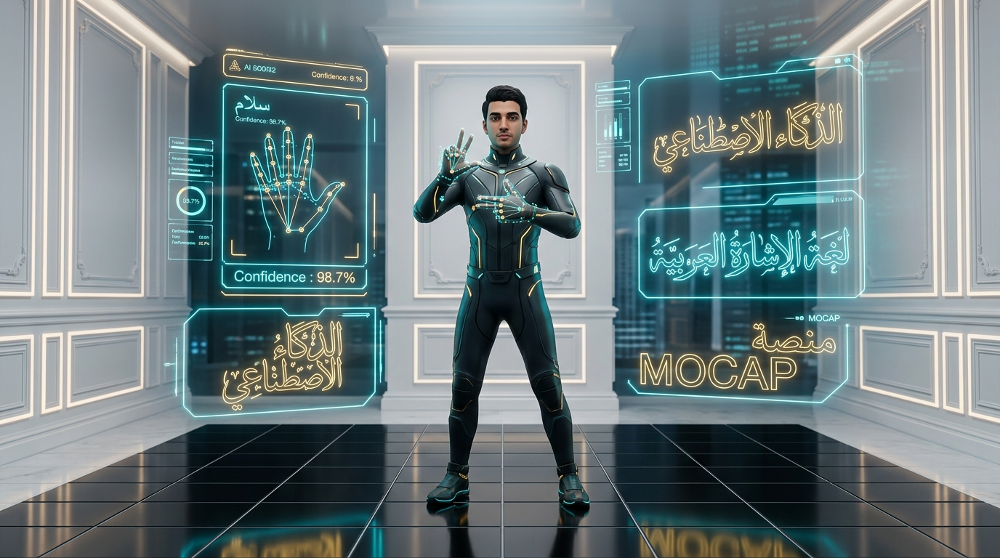
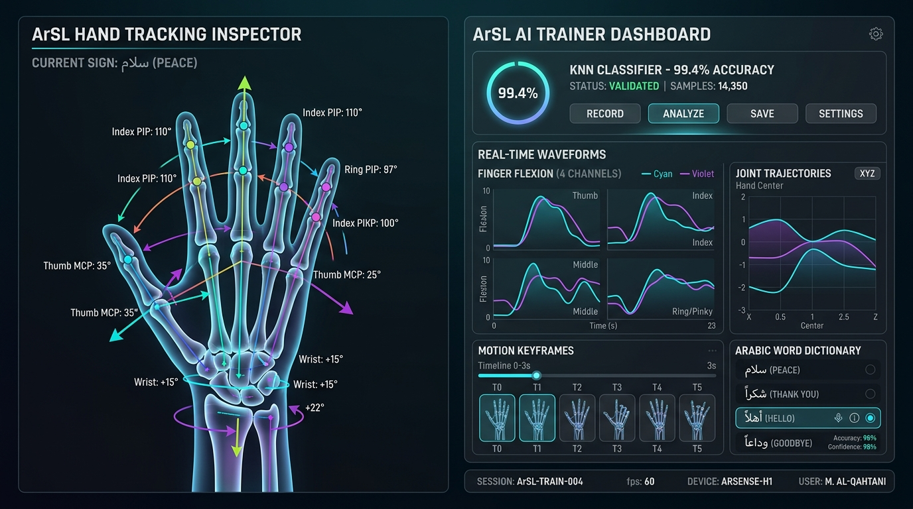
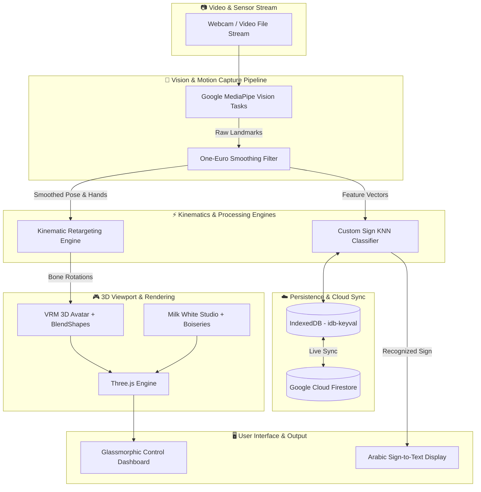

<div align="center">

# 🤟 Arabic Sign Language Recognition & 3D MoCap AI System
### 🤖 نظام الذكاء الاصطناعي لالتقاط الحركة ثلاثي الأبعاد والتعرف على لغة الإشارة العربية

<br/>



<br/><br/>

[](https://arabic-sign-mocap-3d.vercel.app)
[](https://github.com/marwanzidan086-coder/arabic-sign-language-mocap-3d/stargazers)
[](LICENSE)
[](https://threejs.org/)
[](https://developers.google.com/mediapipe)
[](https://firebase.google.com/)
[](#)
[](CONTRIBUTING.md)

<br/>

**A Next-Generation Web Platform connecting AI Computer Vision, 3D Kinematics, and Arabic Sign Language Communication**  
*منصة ويب فائقة التطور تجمع بين الرؤية الحاسوبية بالذكاء الاصطناعي، والرسوميات ثلاثية الأبعاد، والتقاط الحركة للغة الإشارة العربية في الوقت الفعلي.*

<br/>

[🚀 التجربة المباشرة (Live Demo)](#-تجربة-المشروع-المباشرة-live-demo) • [✨ المميزات الرئيسية](#-المميزات-الرئيسية-key-features) • [🎓 مدرب الإشارات](#-مدرب-الإشارات-المخصص-gesture-trainer--inspector) • [🛠️ البنية التقنية](#-البنية-البرمجية-والتقنيات-architecture--tech-stack) • [⚡ التشغيل المحلي](#-التشغيل-والتثبيت-المحلي-quick-start) • [📁 هيكل الملفات](#-هيكل-المشروع-project-structure) • [🤝 المساهمة](#-المساهمة-والتطوير-contributing)

---

</div>

<br/>

## 🌐 تجربة المشروع المباشرة (Live Demo)

يمكنك تجربة النظام بالكامل مباشرة الآن من أي متصفح ويب على الحاسوب أو الهاتف الذكي دون الحاجة لتثبيت أي برامج:  

<div align="center">

👉 **[https://arabic-sign-mocap-3d.vercel.app](https://arabic-sign-mocap-3d.vercel.app)** 👈

</div>

> [!TIP]
> **أداء فائق بالكامل داخل المتصفح (In-Browser 60 FPS):**  
> يعمل النظام بالكامل على عتاد العميل (Client-Side) باستخدام تقنيات `WebGL` و `Web Workers` و `SIMD-accelerated MediaPipe` دون إرسال الفيديو لأي خادم خارجي، مما يضمن أقصى درجات الخصوصية والسرعة اللحظية.

---

## ✨ المميزات الرئيسية (Key Features)

<table>
  <tr>
    <td width="50%">
      <h3>🎓 1. مدرب ومفتش الإشارات (Gesture Trainer)</h3>
      <ul>
        <li><b>تسجيل عينات حركية:</b> تسجيل إشارات مخصصة من كاميرا الويب أو ملف فيديو لمدة 3 ثوانٍ بدقة متناهية.</li>
        <li><b>خوارزميات تصنيف ذكية:</b> مقارنة ديناميكية للمسافات والزوايا بين مفاصل الأصابع واليدين (KNN & Cosine Distance Matching).</li>
        <li><b>مشغل حركي 3D:</b> مراجعة وتشغيل حركة الهيكل العظمي المسجل إطاراً بإطار للتأكد من دقة الإشارة.</li>
      </ul>
    </td>
    <td width="50%">
      <h3>🤖 2. التقاط الحركة والأفاتار 3D (3D MoCap)</h3>
      <ul>
        <li><b>دعم مجسمات VRM:</b> استيراد وتحريك الأفاتار ثلاثي الأبعاد بصيغة <code>.vrm</code> بدقة حركية وفيزيائية فائقة.</li>
        <li><b>تتبع شامل للوجه والجسم:</b> تتبع فوري لحركات الرأس، تعابير الوجه (BlendShapes)، واليدين والأصابع كاملة.</li>
        <li><b>محرر العظام المباشر (Bone Inspector):</b> ضبط وتدوير ومعاينة زوايا العظام مع أدوات Transform Gizmos.</li>
      </ul>
    </td>
  </tr>
  <tr>
    <td width="50%">
      <h3>💬 3. مترجم الإشارة إلى نص فوري (Sign-to-Text)</h3>
      <ul>
        <li><b>ترجمة فورية مستمرة:</b> تعرف فوري ومستمر على الإشارات المنجزة وتحويلها إلى كلمات وجمل عربية واضحة.</li>
        <li><b>محرك تصفية الاهتزاز (One-Euro Filter):</b> فلترة الضوضاء وتثبيت التنبؤات للحصول على مخرجات دقيقة بدون وميض.</li>
        <li><b>أدوات إدارة النصوص:</b> نسخ النصوص المترجمة للحافظة بزر واحد وتفريغ الشاشة بسهولة.</li>
      </ul>
    </td>
    <td width="50%">
      <h3>☁️ 4. المزامنة السحابية (Firebase Cloud Sync)</h3>
      <ul>
        <li><b>حفظ سحابي فوري:</b> مزامنة كل الإشارات المدربة وقواعد البيانات مباشرة مع Google Cloud Firestore.</li>
        <li><b>تخزين هجين (IndexedDB + Cloud):</b> استمرار العمل وتخزين البيانات محلياً حتى في حال انقطاع الإنترنت.</li>
        <li><b>استيراد وتصدير JSON:</b> تصدير واستيراد قواعد بيانات الإشارات بضغطة زر لمشاركتها وتداولها.</li>
      </ul>
    </td>
  </tr>
</table>

---

## 🎓 مدرب الإشارات المخصص (Gesture Trainer & Inspector)

<div align="center">
  
</div>

<br/>

يحتوي النظام على واجهة تدريب متقدمة تسمح للمستخدمين والمختصين بتدريب إشارات جديدة في لغة الإشارة العربية:
1. **التسجيل الحركي (3-Second Stream Capture):** أخذ عينات متتالية بمعدل 30-60 إطاراً في الثانية لحركة اليدين والأصابع.
2. **استخراج الخصائص الحركية (Feature Extraction):** حساب المسافات النسبية لـ 21 نقطة مفصلية لكل يد مع معادلة تدوير المعصم لمنع حساسية الموضع.
3. **المعاينة ثلاثية الأبعاد (3D Keyframe Playback):** شريط زمني تفاعلي لمعاينة الحركة الملتقطة والتأكد من وضوحها قبل حفظها.
4. **المزامنة مع Firebase:** تخزين النموذج المخصص سحابياً ليصبح متاحاً على الفور لجميع المستخدمين.

---

## 🏛️ بيئة الاستوديو ثلاثي الأبعاد (Studio Environment)

- **استوديو أبيض ناصع فاخر (Pure Milk White Studio):** إضاءة سينمائية محيطية فائقة النقاء (`AmbientLight` + `DirectionalLights`) بدون ظلال رمادية باهتة.
- **بانوهات جدارية كلاسيكية (Architectural Boiseries):** جدار خلفي أنيق مصمم بإطارات بانوهات مزدوجة وحزام معماري لإبراز عمق الأفاتار ثلاثي الأبعاد.
- **أرضية سيراميك بيضاء بمربعات واضحة:** أرضية مقسمة بخطوط شبكية سوداء هندسية حادة لتوضيح أبعاد المشهد ومنظور الكاميرا وحركة القدمين.

---

## 🛠️ البنية البرمجية والتقنيات (Architecture & Tech Stack)



### جدول التقنيات (Tech Stack Matrix)

| الطبقة / المكون | التقنية المستخدمة | الدور والأهمية |
| :--- | :--- | :--- |
| **محرك الجرافيكس 3D** | [Three.js r128](https://threejs.org/) + [@pixiv/three-vrm](https://github.com/pixiv/three-vrm) | عرض البيئة ثلاثية الأبعاد، تحريك عظام الأفاتار، وضبط الإضاءة |
| **الرؤية الحاسوبية والذكاء الاصطناعي** | [Google MediaPipe Tasks Vision](https://developers.google.com/mediapipe) | استخراج إحداثيات الوجه واليدين والوضعية بأعلى سرعة وأقل استهلاك |
| **تنعيم الحركة والفلترة** | `One-Euro Filter Algorithm` | القضاء على الاهتزاز وتثبيت حركة الأصابع والمفاصل |
| **قاعدة البيانات السحابية** | [Google Cloud Firestore](https://firebase.google.com/) | المزامنة اللحظية للإشارات المخصصة بين المستخدمين |
| **التخزين المحلي** | [IndexedDB (idb-keyval)](https://github.com/jakearchibald/idb-keyval) | التخزين الدائم للبيانات على جهاز المستخدم للعمل دون إنترنت |
| **واجهة المستخدم** | Modern Glassmorphic CSS3 + FontAwesome 6 | واجهة تفاعلية زجاجية حديثة متجاوبة مع كافة الشاشات |
| **الاستضافة والنشر** | [Vercel](https://vercel.com/) | استضافة سريعة مع تفعيل ترويسات الأمان المتقدمة (COOP/COEP) |

---

## ⚡ التشغيل والتثبيت المحلي (Quick Start)

### 1. استنساخ المستودع (Clone Repository)
```bash
git clone https://github.com/marwanzidan086-coder/arabic-sign-language-mocap-3d.git
cd arabic-sign-language-mocap-3d
```

### 2. تشغيل خادم محلي (Run Local Web Server)
نظراً لاستخدام تقنيات `ES Modules` و `Web Workers`، يلزم تشغيل المشروع عبر خادم ويب محلي:

**باستخدام Node.js / npx (موصى به):**
```bash
npx serve .
```

**أو باستخدام Python 3:**
```bash
python -m http.server 8080
```

**أو عبر إضافة Live Server في VS Code:**
- اضغط كليك يمين على `index.html` واختر **Open with Live Server**.

### 3. فتح التطبيق
افتح المتصفح على العنوان:
👉 **`http://localhost:8080`**  
*(يرجى السماح للتطبيق بالوصول إلى الكاميرا عند طلب المتصفح)*

---

## ⌨️ اختصارات لوحة المفاتيح (Keyboard Shortcuts)

| المفتاح | الوظيفة | الوصف |
| :---: | :--- | :--- |
| <kbd>W</kbd> | **وضع النقل (Translate)** | تحريك المفاصل والعظام في الفضاء ثلاثي الأبعاد |
| <kbd>E</kbd> | **وضع التدوير (Rotate)** | تدوير زوايا المفاصل يدpropياً |
| <kbd>R</kbd> | **وضع القياس (Scale)** | تكبير أو تصغير حجم العظام المحددة |
| <kbd>Q</kbd> | **وضع التحديد (Select)** | تفعيل وضع التحديد وإيقاف المحاور |
| <kbd>Space</kbd> | **إيقاف / تشغيل (Play/Pause)** | إيقاف حركة الأفاتار مؤقتاً لمعاينة وضعية محددة |
| <kbd>Esc</kbd> | **إلغاء التحديد (Deselect)** | إلغاء تحديد المفصل المختار حالياً |

---

## 📁 هيكل المشروع (Project Structure)

```text
arabic-sign-language-mocap-3d/
├── .github/
│   ├── assets/                     # الصور والشعارات عالية الدقة للتوثيق
│   │   ├── hero_banner.jpg         # البانر الرئيسي للمستودع
│   │   └── gesture_trainer_mockup.jpg # موك أب واجهة المدرب الحركي
│   ├── ISSUE_TEMPLATE/             # قوالب تقارير الأخطاء والاقتراحات
│   └── workflows/ci.yml            # إجراءات الفحص والتحقق الآلي (CI)
├── index.html                      # واجهة المستخدم وتخطيط مساحة العمل ثلاثية الأبعاد
├── style.css                       # تصميم الواجهة الزجاجية التفاعلية الحديثة
├── trainer.css                     # تصميم نافذة ومدرب الإشارات المخصص
├── app.js                          # نقطة الانطلاق وإدارة دورة حياة التطبيق
├── viewport.js                     # إعداد المشهد ثلاثي الأبعاد، الكاميرا، واستوديو البانوهات
├── mocap-core.js                   # معالجة وتوزيع إطارات MediaPipe على محركات الحركة
├── mocap-pose.js                   # ربط وتطويع حركات الجسم والوضعية بعظام الأفاتار
├── mocap-constraints.js            # الحدود والقيود الفيزيائية والميكانيكية للمفاصل
├── mocap-filters.js                # مرشحات One-Euro لتنعيم الحركة ومنع الاهتزاز
├── mocap-idle.js                   # نظام الحركة الحيوية التلقائية للأفاتار (Idle Breathing)
├── mocap-recorder.js               # مسجل حركات الأفاتار بصيغة Keyframes و BVH
├── customGestureRecognizer.js      # محرك التعرف الذكي ومطابقة المسافات الهندسية للإشارات
├── customGestureStore.js           # نظام إدارة ومزامنة البيانات (IndexedDB + Firestore)
├── firebase-db.js                  # إعداد وتجهيز خدمات Google Firebase Firestore
├── avaturn_avatar.vrm              # نموذج الأفاتار ثلاثي الأبعاد المجهز افتراضياً
├── vercel.json                     # إعدادات النشر وتوافقية المتصفحات وتفعيل COOP/COEP
├── package.json                    # تبعيات ومعلومات المشروع
├── CONTRIBUTING.md                 # دليل المساهمة في المشروع
├── CODE_OF_CONDUCT.md              # ميثاق السلوك للمجتمع
├── SECURITY.md                     # سياسة الأمان والإبلاغ عن الثغرات
└── LICENSE                         # رخصة الاستخدام (MIT)
```

---

## 🤝 المساهمة والتطوير (Contributing)

نرحب بكافة المساهمات من المطورين والمصممين والباحثين! إذا كنت ترغب في تحسين المشروع أو إضافة إشارات جديدة:
1. راجع [دليل المساهمة (CONTRIBUTING.md)](CONTRIBUTING.md).
2. افتح [Issue جديد](https://github.com/marwanzidan086-coder/arabic-sign-language-mocap-3d/issues) لمناقشة أفكارك ومقترحاتك.
3. أرسل Pull Request بتعديلاتك.

---

## 📄 الترخيص (License)

هذا المشروع مفتوح المصدر ومرخص بالكامل تحت مظلة ترخيص [MIT License](LICENSE).

<br/>

<div align="center">

⭐ **إذا نال المشروع إعجابك، نرجو ترك نجمة (Star) على المستودع لدعم استمرار التطوير!** ⭐

<br/>

**Designed & Developed with ❤️ for the Deaf & Hard-of-Hearing Community**  
صُنع بكل فخر وحب لخدمة مجتمع لغة الإشارة العربية وذوي الهمم 🤟

</div>
