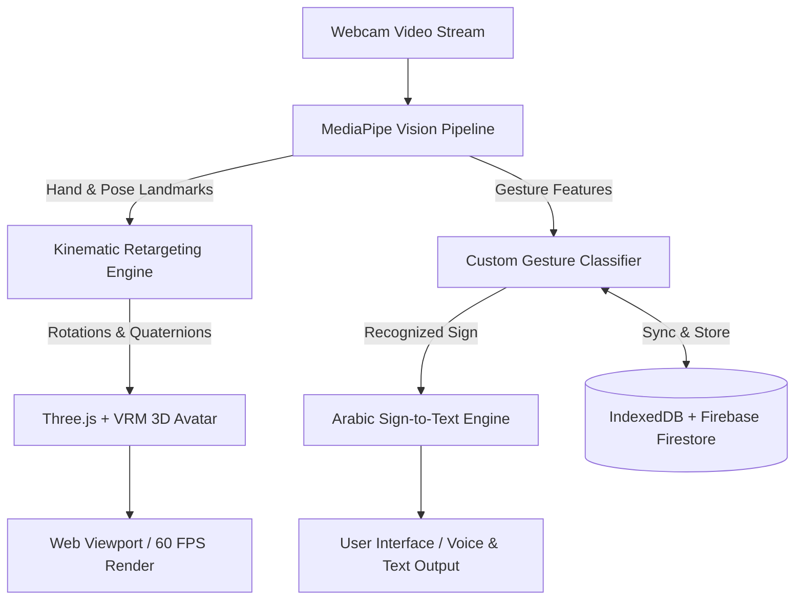

<div align="center">

# 🤟 Arabic Sign Language Recognition & 3D MoCap AI System
### نظام التعرف وتدريب لغة الإشارة العربية والتقاط الحركة ثلاثي الأبعاد للأفاتار

<br/>

[](https://arabic-sign-mocap-3d.vercel.app)
[](https://github.com/marwanzidan086-coder/arabic-sign-language-mocap-3d/stargazers)
[](LICENSE)
[](https://threejs.org/)
[](https://developers.google.com/mediapipe)
[](https://firebase.google.com/)

<br/>

**A Next-Generation Web Platform connecting AI Vision, 3D Kinematics, and Arabic Sign Language Communication**  
*منصة ويب متطورة فائقة الذكاء تجمع بين الذكاء الاصطناعي، والرسوميات ثلاثية الأبعاد، والتقاط الحركة للغة الإشارة العربية في الوقت الفعلي.*

<br/>

[🚀 التجربة الحية (Live Demo)](#-تجربة-المشروع-المباشرة-live-demo) • [✨ المميزات الرئيسية](#-المميزات-الرئيسية-key-features) • [🛠️ التقنيات المستخدمة](#-التقنيات-والبنية-البرمجية-tech-stack) • [⚡ التشغيل المحلي](#-التشغيل-والتثبيت-المحلي-quick-start) • [📁 هيكل المشروع](#-هيكل-الملفات-project-structure)

---

</div>

<br/>

## 🌐 تجربة المشروع المباشرة (Live Demo)

يمكنك تجربة النظام مباشرة الآن من أي متصفح ويب على سطح المكتب أو الهاتف:  
👉 **[https://arabic-sign-mocap-3d.vercel.app](https://arabic-sign-mocap-3d.vercel.app)**

> [!TIP]
> يعمل التطبيق بالكامل داخل المتصفح بأعلى أداء (60 FPS) مستفيداً من تقنيات تسريع العتاد WebGL و Web Workers دون الحاجة لتثبيت أي برامج خارجية!

---

## ✨ المميزات الرئيسية (Key Features)

<table>
  <tr>
    <td width="50%">
      <h3>🎓 1. مدرب الإشارات المخصص (Gesture Trainer)</h3>
      <ul>
        <li><b>تسجيل عينات حركية:</b> تسجيل إشارات مخصصة من كاميرا الويب أو ملف فيديو لمدة 3 ثوانٍ بدقة متناهية.</li>
        <li><b>خوارزميات تصنيف ذكية:</b> مقارنة ديناميكية للمسافات والزوايا بين مفاصل الأصابع واليدين (KNN / Kinematics Matching).</li>
        <li><b>مراجعة ثلاثية الأبعاد (3D Playback):</b> مشغل مدمج لمعاينة ومراجعة حركة الهيكل العظمي المسجل خطوة بخطوة.</li>
      </ul>
    </td>
    <td width="50%">
      <h3>🤖 2. التقاط الحركة والأفاتار 3D (3D MoCap)</h3>
      <ul>
        <li><b>دعم مجسمات VRM:</b> استيراد وتحريك الأفاتار ثلاثي الأبعاد بصيغة <code>.vrm</code> بدقة فيزيائية.</li>
        <li><b>تتبع كامل للجسم والوجه:</b> تتبع فوري لحركات الرأس، تعابير الوجه (BlendShapes)، واليدين والأصابع.</li>
        <li><b>محرر العظام (Bone Inspector):</b> ضبط وتعديل وتصدير زوايا وأوضاع العظام مع معاينة مباشرة.</li>
      </ul>
    </td>
  </tr>
  <tr>
    <td width="50%">
      <h3>💬 3. مترجم الإشارة إلى نص فوري (Sign-to-Text)</h3>
      <ul>
        <li><b>ترجمة حية ومستمرة:</b> تعرف فوري على الإشارة وتجميعها لجمل وكلمات متناسقة باللغة العربية.</li>
        <li><b>أدوات نسخ سريعة:</b> نسخ النصوص المترجمة للحافظة بزر واحد وتفريغ الشاشة بسهولة.</li>
      </ul>
    </td>
    <td width="50%">
      <h3>☁️ 4. المزامنة السحابية (Firebase Cloud Sync)</h3>
      <ul>
        <li><b>حفظ سحابي فوري:</b> مزامنة كل الإشارات المدربة وقواعد البيانات مباشرة مع Google Cloud Firestore.</li>
        <li><b>مزامنة عبر الأجهزة:</b> إمكانية الوصول للبيانات المسجلة من أي جهاز ومتصفح مختلف.</li>
        <li><b>استيراد وتصدير JSON:</b> نسخ احتياطي واسترجاع شامل لقواعد بيانات الإشارات بضغطة زر.</li>
      </ul>
    </td>
  </tr>
</table>

---

## 🏛️ بيئة العرض والتصميم الثلاثي الأبعاد (Studio Environment)

- **استوديو أبيض فاخر (Pure Milk White Studio):** إضاءة سينمائية محيطية متطورة بدون ظلال رمادية لتوفير وضوح تام لكل حركة.
- **بانوهات كلاسيكية مودرن (Architectural Boiseries):** جدار خلفي فاخر بإطارات بانوهات مزدوجة وحزام وسطي يعطي عمقاً فوتوغرافياً واحترافياً.
- **أرضية سيراميك بيضاء بمربعات واضحة:** أرضية مقسمة بخطوط شبكية سوداء هندسية حادة لتوضيح أبعاد المشهد ومنظور الكاميرا.

---

## 🛠️ التقنيات والبنية البرمجية (Tech Stack)



| المكون | التقنية المستخدمة | الوصف |
| :--- | :--- | :--- |
| **محرك الجرافيكس 3D** | [Three.js](https://threejs.org/) + [@pixiv/three-vrm](https://github.com/pixiv/three-vrm) | معالجة الرسوميات، تحريك عظام الأفاتار، وإضاءة المشهد |
| **الرؤية الحاسوبية والذكاء الاصطناعي** | [Google MediaPipe Tasks Vision](https://developers.google.com/mediapipe) | استخراج إحداثيات الوجه، اليدين، والوضعية بزمن وصول فائق السرعة |
| **قاعدة البيانات السحابية** | [Google Firebase Cloud Firestore](https://firebase.google.com/) | تخزين ومزامنة الإشارات المدربة سحابياً |
| **التخزين المحلي السريع** | [IndexedDB (idb-keyval)](https://github.com/jakearchibald/idb-keyval) | تخزين البيانات على جهاز المستخدم للعمل دون اتصال بالإنترنت |
| **واجهة المستخدم** | Modern Glassmorphic CSS3 + FontAwesome | تصميم استثنائي مستقبلي متجاوب مع جميع الشاشات |

---

## 🚀 التشغيل والتثبيت المحلي (Quick Start)

### 1. استنساخ المستودع (Clone Repository)
```bash
git clone https://github.com/marwanzidan086-coder/arabic-sign-language-mocap-3d.git
cd arabic-sign-language-mocap-3d
```

### 2. تشغيل خادم محلي (Local Web Server)
نظراً لأن المشروع يستخدم تقنيات `ES Modules` و `Web Workers`، يفضل تشغيله عبر سيرفر محلي:

**باستخدام Node.js / npx:**
```bash
npx serve .
```

**أو باستخدام Python 3:**
```bash
python -m http.server 8080
```

### 3. فتح التطبيق
افتح المتصفح على العنوان:
👉 **`http://localhost:8080`**  
*(تأكد من السماح بالوصول إلى الكاميرا عند طلب المتصفح)*

---

## ⌨️ اختصارات لوحة المفاتيح (Keyboard Shortcuts)

| الاختصار | الوظيفة |
| :---: | :--- |
| <kbd>W</kbd> | تفعيل وضع تحريك المفاصل (Translate Mode) |
| <kbd>E</kbd> | تفعيل وضع تدوير العظام (Rotate Mode) |
| <kbd>R</kbd> | تفعيل وضع تغيير الحجم (Scale Mode) |
| <kbd>Q</kbd> | تفعيل وضع التحديد (Select Mode) |
| <kbd>Space</kbd> | إيقاف / تشغيل مؤقت لحركة الأفاتار |
| <kbd>Esc</kbd> | إلغاء تحديد المفصل الحالي |

---

## 📁 هيكل الملفات (Project Structure)

```text
├── 📄 index.html                 # واجهة المستخدم الرئيسية وتخطيط مساحة العمل ثلاثية الأبعاد
├── 🎨 style.css                  # تصميم الواجهة الزجاجية التفاعلية الحديثة
├── 🎨 trainer.css                # تصميم نافذة ومدرب الإشارات المخصص
├── ⚡ app.js                     # نقطة البداية وتشغيل النظام وتكامل الموديولات
├── 🌐 viewport.js                # إعداد المشهد، الكاميرا، استوديو البانوهات، ومحرك Three.js
├── 👁️ mocap-core.js              # معالجة وتوزيع إطارات MediaPipe على محركات الحركة
├── 🦴 mocap-pose.js              # ربط حركات الجسم وإحداثيات الوضعية بعظام الأفاتار
├── 📐 mocap-constraints.js       # القيود والحدود الفيزيائية والميكانيكية للمفاصل
├── 🌊 mocap-filters.js           # مرشحات One-Euro لتنعيم الحركة ومنع الاهتزاز
├── 💾 mocap-recorder.js          # مسجل حركات الأفاتار بصيغة Keyframes و BVH
├── 🧠 customGestureRecognizer.js # محرك التعرف الذكي ومطابقة المسافات الهندسية للإشارات
├── 📦 customGestureStore.js      # نظام إدارة ومزامنة البيانات (IndexedDB + Firestore)
├── 🔥 firebase-db.js             # إعداد وتجهيز خدمات Google Firebase Firestore
├── 👤 avaturn_avatar.vrm         # نموذج الأفاتار ثلاثي الأبعاد المجهز افتراضياً
└── ⚙️ vercel.json                # إعدادات النشر وتوافقية المتصفحات والأمان (COOP/COEP)
```

---

## 📄 الترخيص (License)

هذا المشروع مفتوح المصدر ومتاح بالكامل تحت مظلة ترخيص [MIT License](LICENSE).

<br/>

<div align="center">

🌟 **إذا أعجبك المشروع، لا تنسَ ترك نجمة (Star) على المستودع لدعم استمرار التطوير!** 🌟

<br/>

**Made with ❤️ for the Arabic Sign Language & Deaf Community**  
صُنع بكل حب لخدمة مجتمع لغة الإشارة العربية وذوي الهمم 🤟

</div>
